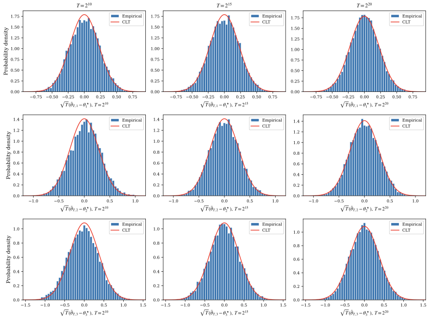
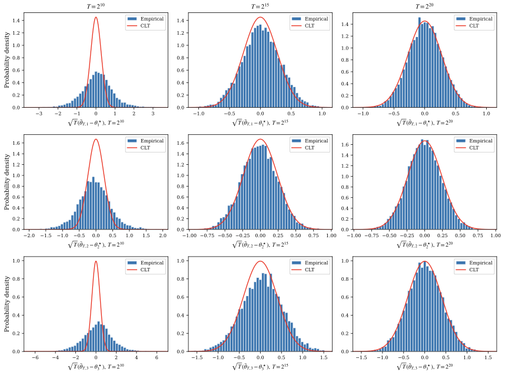
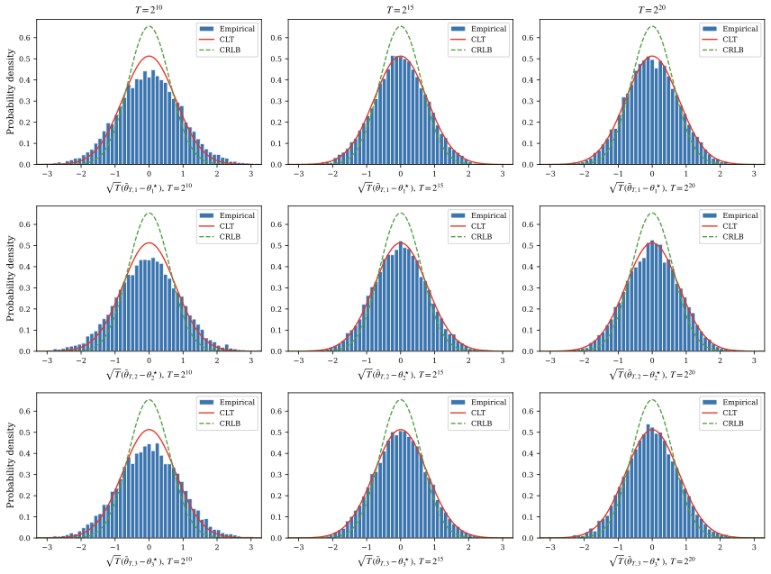

# Numerical Simulations of Central Limit Theorems and Cramer-Rao Lower Bounds for Stochastic Approximation on Stationary Processes

## Results

### Linear Stochastic Approximation with Gaussian noise

### Markov reward process

### Linear Regression with auto-regressive noise

### Linear Stochastic Approximation with Gaussian linear-process noise

